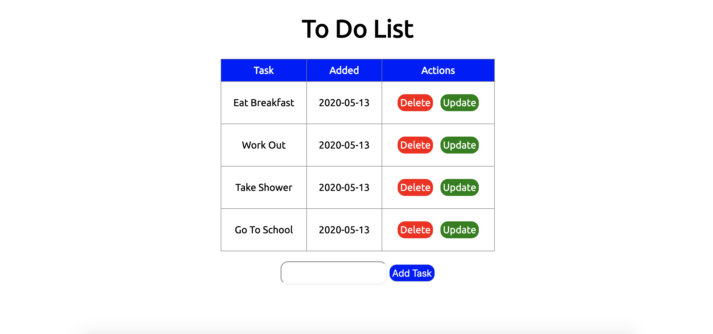

# To-Do-Flask
A CRUD app built with HTML, CSS, and Python to practice routing with Flask.

I decided to build this app as a way to continue my growth with Python while utilizing prior knowledge with routing, HTML, and CSS. This was built using a tutorial with freeCodeCamp.

If you want to check out the deployed version of this app, please follow the link here: https://github.com/ptj92e/To-Do-Flask

### HTML and CSS
The templates for this app were built out of HTML and CSS files. They were the framework that the app used to render the interface. 

### Python Flask
Flask is a framework similar to Express.js which Python uses to handle routes to develop dynamic back ends to applications. The Flask syntax was very similar to the way Express handles routes by establishing the route and then attaching the method associated with that route. 

This is an app with full CRUD capabilities. There are GET, POST, DELETE, and UPDATE routes so that they user can create, view, update, and delete different tasks for their day. 

### Jinja 2
The exciting part about this app is the use of Jinja 2. It is very similar to Express Handlebars where there is a base template where other views are rendered through. When the app is opened, the user is presented with any tasks they have yet to complete. Once they are completed, the user can delete them. If there was a typo, the user can update the task so it can display the correct task.

### SQL Lite
This is a database that is stored within the directory of the application. It is very simple and light weight so it is perfect for a simple To Do List with no relational tables needed. 